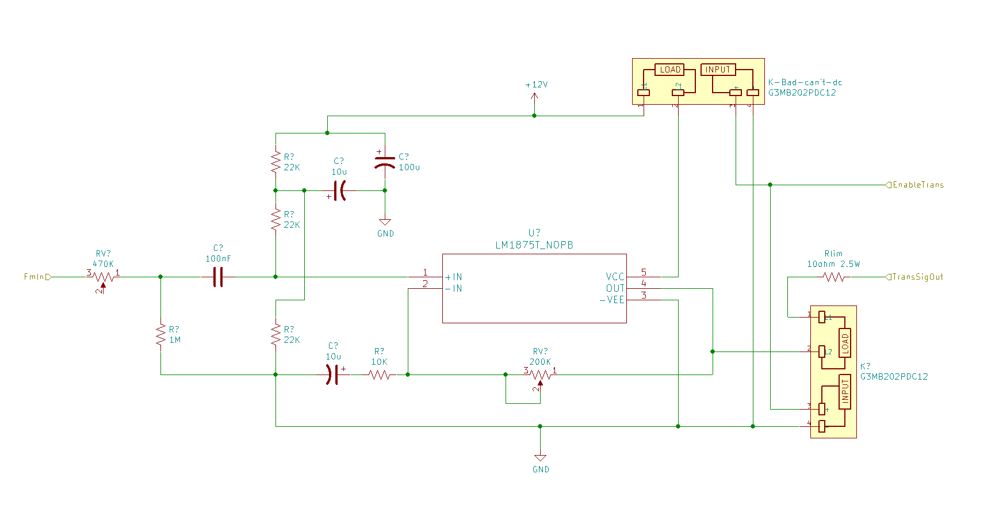

# Simple Arduino VLF Radio

This page contains the hardware for building a cave radio

# Status

*Incomplete*

# Flowchart

Transmitter:

  - Use a summing amplifier to change the analog voltage input level based on a digital input
  - Generate square wave with frequency based on input control voltage
  - Filter to a sine wave using active 8th order switched-capacitor filter
  - Amplify sine wave with generic audio amplifier
  
 Reciever:
 
  - Low pass filter antenna signals to limit noise
  - High pass filter signals to limit 60hz noise
  - Dampen spikes with zener diodes to prevent damage to FET
  - Decrease the input impedance of the input by running it through a JFET to prepare signal for amplification
  - Low pass filter signal to limit noise and channel bleed
  - Perform high gain signal amplification with BJT transistor
  - Actively amplify signal with Opamp circuit
  - Actively amplify and filter signal with Sallen-key Opamp circuit
  - Decode FM modulation with a tone-decoder

# Transmitter

## Power Supply

The radio operates at two different power levels: 12V-14.4V and 5V. All of the logic circuits operate using the 5V power supply and care must be taken to ensure that the 12V voltage is not introduced to the 5V components through either direct connection or back-volting (accidental voltage back along a signal path.

It is expected that the higher voltage will come from the battery pack at either 12V/14.4V/etc. 

The 5V is obtained through a simple regulator circuit. These components are common and easily obtained. Any 5V output regulator will work here.

## Signal Generation

Because this radio is designed as a VLF radio at approximately 5Khz, this radio is designed to use either morse code, beeping, or digital communications (serial). At 5Khz there is not enough bandwidth available for voice transmissions and it is not attempted here.

The first part of the Signal Generator is a digital input to reference voltage converter. This takes a digital input and converts 0's to a high reference voltage, and 1's to a low reference voltage. This is backwards because of the way our tone decoder will work on the receiver. The center reference voltage is determine by one potentiometer and the distance between the reference voltages is set by the other potentiometer.

The reference voltage(s) are fed into the control pin of a 555 timer. This 555 timer is configured around the desired center frequency (4700 Khz). It is necessary to adjust the potentiometers on the reference voltage converter to ensure that the center reference voltage matches the desired center frequency. The configuration is set so that a single frequency will produce a 50% duty cycle square wave. If the reference voltage is set for a different center frequency then you will get the different frequency with a lower duty cycle (example 30% duty cycle). Since we want a sine wave for transmission we need to be as close to 50% duty cycle as possible. In order to have a reasonable amount of signal separation for a tone decoder on the receiver I am setting the frequency difference to approximately 200Hz (1 is 4600Hz and 0 is 4800Hz). 

Next, the square wave is fed into a low pass switch capacitor filter with a cutoff value of approximately 10% more than the desired center frequency. Reviewing the fourier series of a square wave is the sum of all odd multiples of the sine wave at our center frequency. This mean that if we filter all waves above our center frequency it will turn our square wave into a sine wave. 

## Transmitter Amplification

The final stage in the transmitter is to amplify the sine wave and output it to an antenna. Since this radio is designed to operate near 5Khz we can simply use a low-distortion audio amplifier. For this circuit I am using the common LM1875 audio amplifier. This circuit is designed to operate at up to 2W of output power as adjusted using the potentiometer. 

## Transmitter Overview

The transmitter takes in a digital signal (0 or 1) and outputs a high power sine wave that is 100Hz above or below the center frequency of 4700Hz. 

# Transmitter / Receiver Isolator

Note: It is necessary to isolate the transmitter from the receiver. In simple radios this can be done with a single pole double throw switch. For a microcontrolled radio we need a digital switch. 

It is important that the output of the transmitter is not sent directly into the receiver. The receiver is designed to capture and amplify very small signals. The very large signal from the transmitter can damage the components in the receiver. Also, without isolation, any noise from the transmitter will cause reception problems in the receiver. 

TBD

# Receiver

## Power Supply

The receiver uses the same power requirements as the transmitter. When built as a tranciever this simplifies the circuit substantially.

## First Amplification

## Filter and Second Stage Amplification

## Third stage amplification

## Tone Decoder (FM to Digital)

